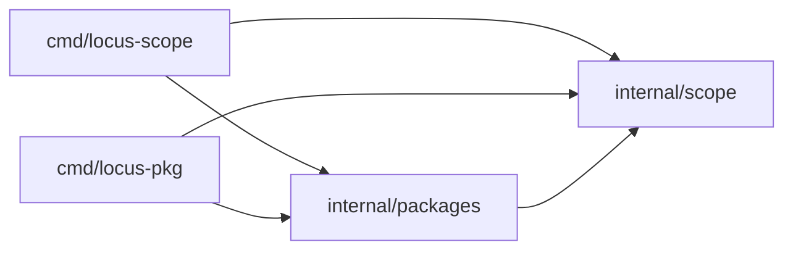

# locus-scope 当前实现快照

## 目录

```text
cmd/
├── locus-scope/
└── locus-pkg/

internal/
├── scope/
└── packages/

deploy/
└── local-zot/

documents/
test/
└── e2e/
```

## 依赖



`cmd` 只负责参数、调用和输出。`internal/scope` 负责 Core semantics；`internal/packages` 负责 OCI、lock、cache、物化和 Source resolver。`deploy/local-zot` 提供固定版本、仅绑定环回地址的仓库本地 OCI Registry 配置与生命周期脚本。项目不使用 `src/`。

## 目录规则

- `internal/` 下按职责建立 package，不要求全部平铺。
- 只有形成独立、可测试且依赖方向清晰的职责时才建立子 package。
- 不使用 `utils`、`common`、`src` 或按文件类型分组的目录。

