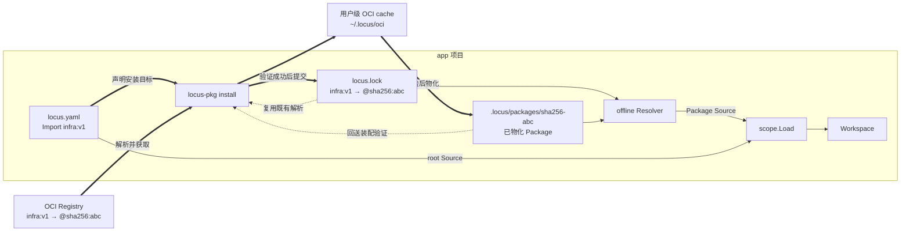

# Package设计

## 简述

Locus Package Infrastructure 把本地 Scope source tree 发布为 OCI artifact，也从 OCI 获取不可变快照，物化到项目后通过统一 Resolver 装配 Workspace。它只扩展 Source 的分发与获取。

## 职责

本文负责 Package artifact、Source identity、`locus.lock`、OCI cache、项目物化、发布与安装流程、loader 接口，以及 `locus-pkg publish` 和 `locus-pkg install`。不负责定义新依赖模型、SemVer、版本范围、dependency solver、Registry Server、签名或供应链策略。

- 协议语义以 [PROTOCOL.md](protocol/PROTOCOL.md) 为唯一权威来源。

## 术语表

- **[OCI（Open Container Initiative）](https://opencontainers.org/)**：制定容器镜像格式和 Registry 分发协议等开放标准的组织。本文使用 [OCI Image Format Specification](https://github.com/opencontainers/image-spec/blob/main/spec.md) 表示 Package artifact，并使用 OCI Distribution 协议从 Registry 推送和获取它。
- **OCI digest**：由摘要算法和十六进制摘要组成的内容寻址标识，例如 `sha256:<hex>`；OCI descriptor 使用它校验并定位 manifest、layer 等对象。本文所称 Package digest 和 Package identity 特指 OCI image manifest digest，不是 tag 或 layer digest。
- **Scope source tree 快照**：某个 root Scope 目录树在特定时刻的不可变副本，包括根 Scope manifest、definition documents，以及目录内通过相对路径组织的子 Scope。它是 Package 实际打包和分发的文件内容，不是协议中的 Scope 对象。
- **Artifact**：存储在 OCI Registry 中、可通过 OCI descriptor 获取和校验的 Package 分发对象；具体结构由“Package 核心设计”约束。
- **`Artifact Type`**：OCI image manifest 中标识 artifact 应用类型和处理语义的字段；它不表示 layer 的编码格式。
- **物化**：将指定 digest 的 Package 从用户级 OCI cache 解包并写入项目的 `.locus/packages/<algorithm>-<digest>/`，形成 Loader 可通过 `LocalPath` 读取的目录。物化只改变 Package 的本地存放形式和位置，不改变其 OCI digest identity。
- **Registry**：通过 OCI Distribution API 保存和分发 artifact 的服务，例如 Zot、Harbor、GHCR 或云厂商 OCI Registry。
- **Package reference**：manifest 中指向 Package 的 `oci://` 地址，可以使用可变 tag，也可以直接使用不可变 OCI digest。
- **Tag**：Registry 中指向某个 manifest 的可变名称，例如 `v1` 或 `latest`；后续发布可以让同一 tag 指向新的 digest，因此 tag 不能作为 Package identity。
- **`locus.lock`**：root Scope 目录中的解析快照，记录可变 Package reference 当前选定的不可变 digest，使后续安装和离线加载能够复用同一份内容。
- **`Source`**：基础含义见[Scope 设计术语表](Scope设计.md#术语表)；本文进一步规定 Package Source 的 OCI identity 和项目内物化路径。
- **Resolver**：基础职责见[Scope 设计术语表](Scope设计.md#术语表)；本文定义安装和离线加载使用的不同实现。

## example：发布共享基础设施

`infra` 目录是待发布 Package 的 root Scope。用户可以显式指定它，并把快照发布到一个带 tag 的 OCI reference：

```text
locus-pkg --scope ./infra publish oci://registry.example.com/locus/infra:v1
```

`--scope` 可以省略；此时从当前目录向父目录查找最近的 Scope manifest，并以其所在目录作为 Package root。显式和自动发现只改变 root 的选择方式，不改变 Package 内容或 identity。

执行成功后，目标 tag 指向由该 Scope source tree 构建的不可变 manifest digest，随后可按下文安装示例直接引用。发布输入、artifact 和提交边界统一见 [Package 核心设计](#package-核心设计)，参数与输出见 [CLI](#cli)。

## example：在项目中使用共享基础设施

假设团队已经把基础设施 Scope 发布为：

```text
oci://registry.example.com/locus/infra:v1
```

应用项目只需要在 root Scope 的 `locus.yaml` 中声明它：

```yaml
id: app
imports:
    infra: oci://registry.example.com/locus/infra:v1
```

此时项目只有声明，没有 Package 文件：

```text
app/
└── locus.yaml
```

用户在项目中执行：

```text
locus-pkg install --scope ./app
```

安装器解析 `infra:v1` 当前指向的 OCI digest，获取并检查对应 artifact，把内容缓存并物化到项目，装配完整 Workspace 验证所有 Scope，最后提交 `locus.lock`。下图强调参与者、存储位置和安装产物，而不是逐行描述命令调用：粗实线表示安装主链，细实线表示安装后的离线装配，虚线表示复用或回验旁路。



成功后，项目中出现可重复使用的安装状态：

```text
app/
├── locus.yaml
├── locus.lock
└── .locus/
    └── packages/
        └── sha256-abc.../
            ├── locus.yaml
            └── ...
```

以后运行 `locus-scope` 时，不再访问 Registry 或用户级 cache，而是使用 `locus.lock` 和 `.locus/packages` 离线装配同一个 Workspace。若 `v1` 后来指向新的 digest，只要现有 lock 条目仍然存在，本项目就继续使用已经锁定的 `sha256:abc...`。

第一次安装成功后，`locus.lock` 固定本例 tag 当前对应的 digest：

```yaml
version: 1
packages:
    "oci://registry.example.com/locus/infra:v1":
        resolved: "oci://registry.example.com/locus/infra@sha256:abc..."
```

## Package 核心设计

本例必须在完整 Workspace 验证成功后提交 lock 和项目物化状态；以后使用同一 lock 离线装配时，必须得到相同的 Package identity 和 Workspace。

| 边界 | 约束 |
| --- | --- |
| 依赖图 | Scope graph 只来自 manifest `imports`；Package 不引入依赖清单、SemVer、版本范围或 dependency solver。 |
| 项目根 | root Scope 目录同时是项目根；`locus.lock` 和 `.locus/packages` 都位于该目录。 |
| Import 来源 | 本地路径沿用 [Scope 装配核心设计](Scope设计.md#scope-装配核心设计)；Package 内相对路径不得逃出 Package 根目录；跨 Package Import 必须使用 `oci://`。 |
| Package reference | 支持 tag 和 digest；省略两者等价于 `:latest`。tag 使用规范化后的可变 reference 作为 lock key；直接使用 digest 时跳过 lock；tag 解析结果必须属于同一 Registry 和 repository。 |
| Package identity | 固定为 OCI image manifest digest；tag、`Manifest.ID`、Import alias、cache 路径和物化路径都不能代替它。 |
| lock 内容 | `locus.lock` 只记录可变 Package reference 到不可变 digest 的解析结果，不复制 Scope graph。 |
| 普通安装 | 已有 lock entry 优先复用；缺失时查询 Registry。完整 Workspace 验证成功后，按 key 字典序原子提交全部 reachable entries，并删除不再 reachable 的旧 entry。 |
| Frozen | lock 的内容和 key 集合必须与完整依赖一致；允许按已锁 digest 获取本地缺失内容，但不得增删改 lock。 |
| Artifact | 使用 OCI 1.1 image manifest：`schemaVersion` 为 `2`，manifest media type 为 `application/vnd.oci.image.manifest.v1+json`，`artifactType` 固定为 `application/vnd.locus.scope.package.v1`；必需的 `config` 使用内容为 `{}` 的 OCI empty JSON descriptor（`application/vnd.oci.empty.v1+json`）；恰好包含一个 `application/vnd.oci.image.layer.v1.tar+gzip` layer，artifact 根目录直接对应 Package root Scope。 |
| 发布输入 | 所选 root Scope 目录形成一个 Scope source tree 快照；包内本地 Import 必须使用 `/` 分隔的相对路径且不得逃出 Package root，OCI Import 只保留 reference，不复制依赖 Package。`locus.lock` 和任意 `.locus` 目录属于项目生成状态，不进入 artifact。发布前必须检查快照中的 Scope 文件和 Package 边界。 |
| 发布产物 | 使用本表规定的 OCI manifest、artifact type 和单 layer 结构。相同 source tree 内容与相关文件 mode 必须产生相同 manifest digest；绝对路径、文件遍历顺序、owner、构建时间和压缩时间不得影响 digest。 |
| 发布目标 | 必须是无 fragment 的 tag reference；省略 tag 规范化为 `:latest`，digest reference 拒绝。同一 tag 可以重复发布：内容未变时得到同一 digest；内容变化时以 manifest/tag 更新为提交边界，使 tag 原子指向新 digest。旧 digest 的 identity 不变，已有 `locus.lock` 不会因 tag 更新而自动漂移。 |
| Artifact 校验 | ORAS 必须校验 manifest、config 和 layer descriptor 的 digest 与 size；拒绝错误的 schema version、manifest media type、artifact type、empty config、layer 数量或 layer media type，以及没有唯一 root Scope manifest 的内容。 |
| 解包 | 流式解压到临时目录；拒绝绝对路径、`.`、`..` 逃逸、反斜杠、重复路径、链接、device、FIFO 和 sparse entry。归档与 Scope 验证全部成功前，不发布目标目录。 |
| Cache | 用户级共享 cache 使用标准 OCI Image Layout，路径为 `~/.locus/oci/r-<registry>/p-<repository-segment>/...`；Registry 和 repository 路径段必须先解析，再做可逆字节编码。 |
| 物化 | 通过检查的 Package 写入 `<root>/.locus/packages/<algorithm>-<digest>/`；项目物化集合保持扁平，可由 lock 和 cache 重建。Loader 只读取项目物化目录，不直接读取用户级 cache。 |
| 已有状态 | 无效的 cache entry 或 digest 物化目录必须报错，不得自动删除或覆盖。 |
| Source identity | Package root 使用 `oci://registry/repository@sha256:<hex>`；内部 Scope 使用 `oci://registry/repository@sha256:<hex>#/relative/path`，fragment 使用 `/` 和 URL 转义。同一 digest 在不同项目中的 Key 保持一致。 |
| Resolver | 通用 Source、Resolver 和 Workspace 装配沿用 [Scope 设计](Scope设计.md)。installing Resolver 可以使用本地路径、Package 内相对路径、lock、Registry、用户级 cache 和项目物化目录；offline Resolver 只能使用本地路径、Package 内相对路径、lock 和已有项目物化目录。 |
| 离线使用 | `locus-scope` 只读取 `locus.lock` 和 `.locus/packages`，不访问 Registry 或用户级 cache，也不修改 lock 和物化内容；缺少 lock entry 或物化目录时失败，诊断以 `run locus-pkg install` 结束。 |
| 事务边界 | 下载、解包、Workspace 验证或 lock 校验任一步失败时，原 `locus.lock` 保持不变，也不得留下新的目标物化目录。 |
| Registry | 客户端使用 OCI Distribution 和 ORAS-go，不实现 Registry Server。仅 `localhost` 和环回 IP 自动使用 HTTP，其他 Registry 使用 HTTPS；认证沿用 Docker config 和 credential helper。Zot 是推荐的本地实现，但不是运行时依赖。 |

## CLI

`locus-pkg` 提供：

- `locus-pkg publish <target>`：检查并打包所选 root Scope 的 Package source tree，把 artifact 发布到 OCI tag reference，并返回不可变 manifest digest。
- `locus-pkg install [--frozen]`：解析完整 reachable graph，获取并物化 Package，验证 Workspace，成功后提交 `locus.lock`。
    - `--frozen`：要求 lock 内容和 key 集合与完整依赖一致，不修改 lock。

对于 `publish` 和 `install`，有 option：

- `--scope <dir>`：指定 root Scope；未指定时从当前目录向父目录查找最近的 Scope manifest。
- `--json`：输出稳定 JSON；`publish` 返回 `target` 和 `digest`，`install` 返回 `valid`、`root`、`resolved`、`reused`、`fetched`、`materialized`、`scopes`、`entities` 和 `relations`。

另外：

- option 可以位于子命令前后；`publish` 的 `<target>` 是子命令的位置参数。
- 默认文本输出中，`publish` 输出规范化目标和 manifest digest；`install` 输出 root，解析、复用、获取和物化计数，以及 Scope、Entity 和 Relation 数量。

## 验收

本设计按以下可观察行为验收：

- 显式 `--scope ./infra` 能发布该 Scope；省略 `--scope` 时能从嵌套工作目录向上发现最近的 Scope 并发布同一份 Package 内容；
- 发布到 `oci://registry.example.com/locus/infra:v1` 后，该 tag 指向命令返回的 manifest digest，安装该 reference 能恢复同一份 Scope source tree；
- 修改 source tree 后再次发布同一 tag，该 tag 改为指向新 digest；新安装解析到新 digest，已有 lock 仍复用原 digest；
- Package 内本地 Import 使用绝对路径、平台特定分隔符或逃出 root，Scope 文件无效，或 artifact 构建失败时不访问 Registry；推送失败时目标 tag 不得指向未完成的 artifact；
- 带 OCI Import 的 root Scope 能通过一次 `locus-pkg install` 得到有效 lock、项目物化目录和完整 Workspace；
- 再次安装复用已有 lock、cache 和物化内容，不改变 Package identity；
- `--frozen` 在 lock 内容和 key 集合与完整依赖图一致时成功，否则失败且不修改 lock；
- Package 内相对 Import、跨 Package Import、循环 Import 和相同 `Manifest.ID` 的不同来源均保持正确 ownership；
- artifact 结构、digest、size、路径或 Scope 内容无效时安装失败，不提交 lock，也不留下目标物化目录；
- 安装后的 `locus-scope` 能在不访问 Registry 和全局 cache 的情况下装配相同 Workspace。

测试分层、fixture、OCI E2E、隔离和完成标准见[测试设计](测试设计.md)。
