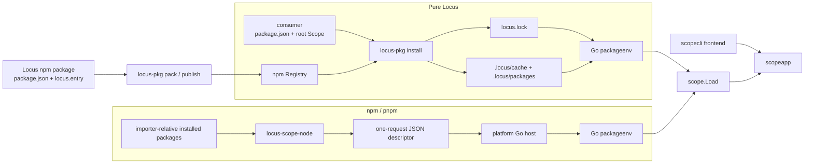

# Package设计

## 简述

Locus Package 使用标准 npm-compatible package 作为唯一分发模型。一个可分发 npm package 对应一个 Scope；`package.json` 是名称、版本和依赖的唯一真相，`locus.entry` 指向包内唯一的 Scope manifest。Pure Locus 与 npm/pnpm 共享同一套 Go Scope/Graph 语义，只在 package environment 的来源上不同。

## 职责

本文定义 package metadata、Import 与 identity、npm Registry、pack/publish、Pure Locus lock/store/事务、Node adapter、私有 Go host 和 `locus-pkg` 命令契约。Entity、Scope、Export、Projection、Relation 和 Group 语义仍以[核心协议](protocol/PROTOCOL.md)为唯一权威来源；本地 Scope 发现、Workspace 装配和检查语义见[Scope 设计](Scope设计.md)。

## 架构与数据流

两种消费方式只负责产生同一种 package environment；从 `packageenv` 开始，Workspace 装配和 CLI 行为完全共用。



## example：发布一个可被两种环境消费的 Package

`@example/app` 的 package root 同时包含标准 npm metadata 和唯一 Scope manifest：

```json
{
  "name": "@example/app",
  "version": "1.0.0",
  "files": ["index.js", "locus.yaml", "definitions"],
  "exports": {
    ".": "./index.js",
    "./package.json": "./package.json"
  },
  "dependencies": {
    "@example/base": "^1.0.0",
    "@example/helper": "^2.0.0"
  },
  "locus": {
    "entry": "locus.yaml"
  }
}
```

它的 Scope 只通过 bare npm name 使用直接依赖；普通 JavaScript dependency `@example/helper` 可以安装，但不会进入 Scope graph：

```yaml
id: example-app
imports:
  base: "@example/base"
```

在 package root 执行：

```text
locus-pkg pack
locus-pkg publish --registry https://registry.example.com/
```

`pack` 生成 `example-app-1.0.0.tgz`，其内容是标准 npm 可安装 tarball；`publish` 对相同 packed view 做校验并发布 `latest`。成功结果包含 name、version、Registry 和 SHA-512 integrity。相同 `name@version` 已存在时返回 immutable-version conflict，而不是覆盖已发布内容。

## example：Pure Locus 安装、锁定并离线检查

本地 consumer 的 root Scope 可以继续使用本地 Import，也可以用 bare name 引用 `package.json.dependencies` 中的 Package：

```json
{
  "private": true,
  "dependencies": {}
}
```

```yaml
id: consumer
imports:
  app: "@example/app"
  modern: "@example/modern"
```

一次显式安装同时修改 root `dependencies`、解析每个 importer 的 SemVer graph、写入 integrity-addressed store，并在完整 Workspace 验证后提交 lock：

```text
locus-pkg install @example/app@^1 @example/modern@^1
locus-pkg list
locus-scope validate --json
```

若 `@example/app@1.0.0` 依赖 `@example/base@^1`，而 `@example/modern@1.0.0` 依赖 `@example/base@^2`，list 中会保留两条 importer-relative edge：

```text
@example/app@1.0.0
└── @example/base@1.1.0
@example/modern@1.0.0
└── @example/base@2.0.0
```

lock 的规范结构如下；实际文件必须包含全部 reachable package records，包括没有 `locus` 的普通 npm dependency：

```yaml
version: 1
importers:
  ".":
    dependencies:
      "@example/app":
        specifier: "^1.0.0"
        package: "npm:@example/app@1.0.0"
packages:
  "npm:@example/app@1.0.0":
    registry: "http://127.0.0.1:4873/"
    resolved: "http://127.0.0.1:4873/@example/app/-/app-1.0.0.tgz"
    integrity: "sha512-..."
    dependencies:
      "@example/base":
        specifier: "^1.0.0"
        package: "npm:@example/base@1.1.0"
```

Registry 停止后，以下命令只能复用兼容 lock 与已经验证的 cache/store，不得发起网络请求：

```text
locus-pkg install --offline --frozen-lockfile
locus-scope validate --json
```

已有 lock 不会因 Registry 新增匹配版本而漂移；`locus-pkg update @example/app` 只解锁该 direct root 的 closure。

## example：通过 npm 或 pnpm 使用同一个 Scope

Node consumer 让 package manager 负责解析、安装、cache 和原生 lockfile：

```text
npm install @sundw/locus-scope @example/app @example/modern
npx locus-scope-node validate --json
```

或：

```text
pnpm add @sundw/locus-scope @example/app @example/modern
pnpm exec locus-scope-node validate --json
```

`locus-scope-node` 从 root importer 开始，在每个 importer 自己的解析上下文中发现 Locus dependency，再把一次性 descriptor 交给平台 Go host。npm hoist 与 pnpm symlink 可以产生不同物理目录，但相同 `npm:<name>@<version>`、entry 和 dependency edges 必须得到与 Pure Locus 相同的 Scope、Entity 和 Relation JSON。

## 约束

下表是本设计的规范性边界；示例只用于说明，不放宽这些约束。

| 领域 | 约束 |
| --- | --- |
| 分发单元 | 一个可分发 Locus package 必须同时是一个标准 npm package、一个分发单元和一个 Scope。Registry server 不属于 Locus 运行时或 standalone 安装器。 |
| Metadata 真相 | `package.json.name`、`version` 和 `dependencies` 分别定义 package 名称、版本和可解析依赖。每个下载、解包或 Node 解析得到的 package 都必须严格校验 JSON、name、version 和 dependency fields。 |
| `locus` metadata | 没有 `locus` 的 package 仍参与安装、lock 和完整依赖图，但不进入 Scope environment。有 `locus` 时只允许相对 package root 且不经 `..` 或 symlink 逃逸的 `locus.entry`；entry 必须指向 packed tree 中唯一的 `locus.yaml`、`locus.yml` 或 `locus.json`，并通过 Scope source 校验；未知 `locus` 字段失败。 |
| JavaScript 兼容 | `main` 和 JavaScript `exports` 可以并存；存在 `exports` 时，Locus package 必须精确导出 `"./package.json"`，使 importer-relative 解析不依赖物理安装布局。 |
| Import 分类 | `./`、`../` 和平台绝对路径是本地 Import；合法 bare npm name 是 Package Import。Package Import 不得携带版本或 subpath。普通本地 root Scope 可以使用本地 Import；分发 Package 的 Scope 禁止本地或绝对 Import。 |
| Import edge | 每个 bare Scope Import 必须是当前 importer 的直接 `dependencies`；解析必须使用 importer context。同名 package 的多个版本可以并存，并分别拥有其 Scope、Entity 和 Relation。 |
| Scope graph | npm dependency graph 决定可解析 package universe；Scope graph 仍只由各 `locus.entry` 中的 Imports 选择。JavaScript 不解析 Locus definition，也不复制 Scope/Graph 语义。 |
| Package identity | Scope 的语义 identity 固定为 `npm:<name>@<version>`。Registry、resolved tarball URL、integrity、Import alias、package-manager lock、cache/store 路径和物理安装路径都不得参与 identity。 |
| 冲突 identity | 同一语义 identity 只能对应一组一致的 entry 和 resolved Locus dependency edges。不同 source/content、root/entry 或 outgoing edges 产生同一 identity 时必须失败，不得通过扩展 identity 或任选副本掩盖冲突。 |
| Pure dependency 能力 | Pure Locus 首版只解析 Registry SemVer `dependencies`。`peerDependencies`、`optionalDependencies`、npm alias、`file:`、`workspace:`、git 和 URL spec 在被接受的 graph 任一 node 中都失败；`devDependencies` 只用于开发，不解析。 |
| Pure 环境 | `locus-pkg` 自行解析 Registry graph 并维护项目 `.locus/` 与 `locus.lock`；`locus-scope` 从 lock/store 离线构造同一种 `packageenv`。Pure 路径不得要求或调用 Node、npm、pnpm，也不得读取 package-manager 状态。 |
| 本地-only Scope | 没有 package.json 的本地-only Scope 仍可由 `locus-scope` 装配。bare Import 缺少相邻 package.json、lock 或 store 时必须失败，并给出以 `run locus-pkg install` 结束的可执行诊断。 |
| Lock schema | `locus.lock` 必须使用示例中的严格 YAML `version: 1` schema。root importer key 固定为 `"."`，并与当前 `package.json.dependencies` 的名称和 specifier 完全一致；package record 保存 Registry、resolved tgz、SRI integrity 和该版本声明的 dependency edges。 |
| Lock 规范化 | maps 按 key 字典序编码；拒绝未知字段、重复字段、非规范 identity/specifier/URL/SRI、缺失 target、edge/name mismatch、不可达 node，以及同一 identity 对应不同 source/content 或 edges 的 graph。package key 和 edge target 都必须是规范 `npm:<name>@<version>`；循环 edge 只有在每个 target 都是已声明 node 时才有效。 |
| Store 定位 | 原始 tgz 位于 `.locus/cache/<algorithm>-<lowercase-hex>.tgz`，解包内容位于 `.locus/packages/<algorithm>-<lowercase-hex>/package/`；hex 来自解码后的 SRI digest bytes，name/version 不选择物理目录。 |
| Store 复用 | 每次使用 cache 前都重新校验原始 tgz integrity；解包后的 package metadata 必须与 resolved metadata 一致。复用已有 extracted tree 前，必须与该 verified tgz 的安全重解包结果逐字节一致；缺少可验证 cache、已有生成状态无效或内容漂移都失败，不得静默删除或覆盖。 |
| Archive 安全 | tgz 在发布目标目录前流式解到临时目录；拒绝绝对路径、逃逸路径、反斜杠、重复路径、link、device、FIFO 和 sparse entry。packument 上限 16 MiB、compressed tgz 上限 256 MiB、总解包内容上限 1 GiB、entry 上限 100,000、单文件上限 256 MiB。 |
| SRI | 下载后必须先对原始 tgz bytes 验证 `dist.integrity`；只接受 SHA-512 或 SHA-256 SRI。integrity 验证、archive 安全、metadata 和 Scope 校验全部成功后才能发布 store 内容。 |
| Staging | 当前 package.json 与 lock 必须在网络访问前通过校验；metadata resolution、下载、解包、新 dependency map、package.json/lock 变更和完整 Workspace 装配都先在 `.locus/tmp/<operation-id>/` 完成。 |
| 提交边界 | 完整 Workspace 验证成功后，才原子发布 store 目录并替换 `locus.lock`；显式 install/uninstall 同时原子替换 `package.json`。 |
| 回滚 | 任一普通失败都必须恢复原 package.json 和 lock bytes，删除本事务新发布的 store 目录，并且不得破坏此前有效的 cache/store。 |
| 清理 | install/uninstall/update 成功后删除从 root 不可达的 lock nodes 和 extracted package directories；integrity-addressed tgz cache 保留。 |
| Offline | `--offline` 不得请求 metadata 或 tarball，只能使用完整、兼容的 lock 与 cache/store；缺少任一所需内容即失败。 |
| Frozen lock | `--frozen-lockfile` 要求 root specifiers 与有效完整 graph 完全匹配，不得修改 package.json、lock 或 graph；可以从 verified cached tgz 恢复缺失 extracted directory。 |
| Registry 选择 | 优先级依次是命令 `--registry`、`NPM_CONFIG_REGISTRY`、项目 `.npmrc`、用户 `.npmrc`；匹配 package scope 的 `<scope>:registry` 覆盖默认 Registry。用户配置路径遵循 `NPM_CONFIG_USERCONFIG`，配置值支持 `${VAR}` 插值。 |
| Registry 认证 | token 选择匹配请求 URL 的最长前缀 `//host/path/:_authToken`，其次使用 `NPM_TOKEN`。username/password/login 字段不受支持并明确失败。token 不得写入 package.json、`locus.lock`、`.locus`、日志、文本或 JSON 输出。 |
| 网络边界 | 只有 loopback hostname 或 IP 可以使用 plain HTTP；其他 Registry 必须使用 HTTPS。Authorization 不得跨 origin 或 redirect 转发。请求超时最多五分钟，并始终受 caller context 的更短 deadline/cancellation 约束。 |
| Registry client | 必须支持 escaped scoped-package packument/version metadata GET、tarball download 和 npm publish PUT；不调用托管 dependency-resolution service。 |
| Publish body | npm publish PUT body 包含 package metadata、`dist-tags.latest`、SHA-1 `shasum`、SHA-512 `integrity` 和恰好一个 base64 tarball attachment。HTTP 409 映射为明确的 immutable-version conflict。 |
| Pack 输入 | `package.json.files` 必须是非空数组，只接受相对 literal file 或 directory；拒绝 glob metacharacter、`.npmignore`、bundled dependencies、symlink 和依赖 lifecycle script 的 packaging。 |
| Pack 内容 | 目录递归展开；始终包含 root `package.json` 以及 root README、LICENSE、LICENCE、NOTICE files；始终排除 `.git`、`.locus`、`node_modules`、`locus.lock`、生成 archive 和 package root 外路径。packed view 仍必须包含声明的唯一 `locus.entry`。 |
| Pack 确定性 | tar entries 位于 `package/`，使用 slash path 并按字典序排列；owner、mtime 和 gzip metadata 规范化，只包含 regular files/directories。相同输入必须产生相同 tgz 和 integrity。 |
| CLI 契约 | `locus-pkg` 的指令、参数、项目查找、输出和退出状态以 [CLI 公共契约](protocol/CLI.md#package-管理)为准。 |
| Dependency 变更 | 显式 install 保留用户给出的 specifier；bare name 保存 `^<resolved-version>`。install/uninstall 只修改 `dependencies`，保留其他 package.json fields，并用 two-space JSON 与 trailing newline 写回。uninstall/update 只接受 direct dependency name；update 保持 declared constraint。 |
| Resolution 更新 | install 只解锁新增或改变的 roots，named update 只解锁指定 direct roots 的 closures，unnamed update 解锁全部 roots，uninstall 删除指定 roots；其他有效 lock subgraphs 保持不变。每个 constraint 选择最高匹配版本。 |
| List、pack、publish | list 只读取 lock/store 并输出 resolved dependency tree；每个 node 含 `name`、`version`、`identity` 和递归 `dependencies`。pack 将 `@example/app@1.0.0` 写为 package root 下的 `example-app-1.0.0.tgz`。publish 在 `.locus/tmp` pack、发布 `latest`，并删除临时 tgz。 |
| CLI 成功输出 | install/uninstall/update JSON 包含 `valid`、`root`、`added`、`removed`、`updated`、`reused`、`fetched`、`installed`、`packages`、`scopes`、`entities`、`relations`；list 包含 `root` 和递归 `dependencies` nodes；pack 包含 `name`、`version`、`filename`、`integrity`、`files`；publish 包含 `name`、`version`、`registry`、`integrity`。文本模式报告同一事实。 |
| Node 公开面 | 首版 `@sundw/locus-scope` 是 ESM，只公开 `locus-scope-node` CLI，不公开 Node Workspace API 或 lifecycle install script。支持 Windows x64、Linux x64/arm64、macOS x64/arm64；五个 exact-version optional platform packages 只携带对应 Go host，四个 Darwin/Linux package 将 host 声明为 `bin` target，使最终 tarball 中的 host mode 固定为 `0755`。unsupported、missing 或 version/platform-mismatched host package 必须产生稳定 adapter error。 |
| Node root | adapter 应用与 standalone `locus-scope` 相同的显式 `--scope` 或最近 ancestor manifest 规则；只读取该 Scope root 中的 package.json 作为 root importer，并在发给 host 前移除 root-selection options。 |
| Node 解析 | 对每个 importer 使用 `createRequire(pathToFileURL(importerPackageJson)).resolve(name + "/package.json")`。失败时可以解析 bare JavaScript entry 后向上寻找 matching package.json；有 `locus.entry` 的 package 必须能通过 package.json subpath 解析。不得推测、扫描或拼接 `node_modules` 或 pnpm store 路径。 |
| Node descriptor | 从 root importer 开始递归解析每个已发现 Locus package 的直接 dependencies；普通 npm package 不进入 descriptor。无法暴露 package root 的普通 dependency 可省略，之后若 Scope Import 引用它则按 missing importer edge 失败。物理多副本的同一 identity 仅在 entry 与 resolved Locus edges 一致时合并，并选择字典序最小 canonical real path；否则 launch 前失败。descriptor maps 必须确定性排序。 |
| Host request | 私有 host 无 flags 或交互 RPC，从 stdin 读取且只读取一个 version 1 JSON request：`workingDirectory`、`arguments`、含 `scopeRoot`、`packageRoot`、`dependencies` 的 `root`，以及以 `npm:<name>@<version>` 为 key、含绝对 `root`、相对 `entry`、`dependencies` 的 `packages`。拒绝未知字段、unsupported version、trailing JSON、相对或非文件 roots、entry escape 和冲突 identity。 |
| Host response | host 恰好写一个 `{"version":1,"exitCode":0,"stdout":"...","stderr":"..."}` 形状的 response。协议错误在可能时也返回合法 response 和 exit code 1；正常 host process exit code 等于 enclosed CLI code。adapter 原样转发 stdout、stderr 和 exit code；有效 request 在 Workspace 加载前失败时，stderr 仍须遵守 request 的 `--json` 输出模式。npm root 缺少直接 dependency 的诊断必须指向 `pnpm add` 或 `npm install`，不得指向 Pure 环境的 `locus-pkg`。 |
| 共用执行核心 | standalone、Pure 和 Node host 最终都调用同一 `packageenv`、`scope.Load`、`scopeapp` 与 `scopecli`；不得在 JavaScript 或其他入口复制 Scope validation、query 或稳定 JSON view。 |

## 验收

| 场景 | 可观察结果 |
| --- | --- |
| Importer-relative 多版本 | 同一 consumer 可同时解析 `@example/base` 1.x 与 2.x；两个 `npm:` identity、dependency edges 和 ownership 均正确。 |
| 普通 npm dependency | dependency 安装并进入 lock/store，但不进入 Scope graph、descriptor 或 Scope 统计。 |
| 稳定解析 | 新版本发布后已有 lock 不漂移；named update 只更新目标 root closure；frozen mismatch 不修改 bytes；Registry 停止后 offline 仍可检查同一 Workspace。 |
| 双环境一致 | npm 与 pnpm 都能安装同一 Locus package，`locus-scope-node` 的规范 Scope、Entity 和 Relation JSON 与 Pure Locus 一致。 |
| 标准发布消费 | `locus-pkg pack` 产物可被标准 npm/pnpm 安装；publish 后 packument、tgz、integrity 和 immutable conflict 符合 npm 行为。 |
| 安全失败 | 缺失或错误 token、integrity mismatch、unsafe archive、unsupported spec、重复 Scope manifest、blocked package.json export、冲突 identity 和事务中途失败都在相应提交边界前失败；token 不泄漏，原文件 bytes 和有效 store 不变。 |
| 交付边界 | standalone 安装器只分发 `locus-scope` 与 `locus-pkg`；Registry server 和 Node package 不进入该安装器。 |

完整测试注册、fixture、隔离方式和完成命令见[测试设计](测试设计.md)。
