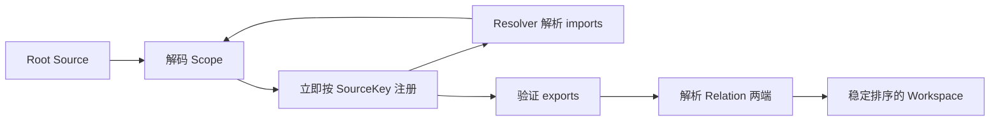

# 基本设计

## 简述

v1 将本地 Scope 文件完整装配为可验证、可查询的内存 Workspace。

## 职责

本文负责本地 Source、文件发现、Workspace 装配、诊断和 CLI 契约。不负责重新定义协议，也不负责远程分发、持久化、编辑或执行。

- 协议语义以 [PROTOCOL.md](protocol/PROTOCOL.md) 为唯一权威来源；本文只定义本地实现边界和工具行为。
- 代码目录与依赖方向只在 [当前架构](../current-architecture.md) 中维护，本文不重复目录树。

## CLI

`cmd/locus-scope` 是 Scope 查询的薄入口，提供：

- `locus-scope validate`：加载并验证完整 reachable graph，成功时输出根 Scope 的来源 identity，以及 Scope、Entity 和 Relation 的数量。不会只检查根 Scope 的 locus.yaml 和 definition documents，而会沿着 imports 加载全部可达 Scope，并验证整个依赖闭包。
- `locus-scope scope show`：显示根 Scope 的 manifest ID、来源 identity、Import alias 及其目标、Export reference。
- `locus-scope scope list`：列出 reachable graph 中的全部 Scope，并标记根 Scope；每项包含 manifest ID 和来源 identity。
- `locus-scope entity list`：列出全部 reachable Entity；每项包含所属 Scope 的 manifest ID、Entity ID 和 owner Scope 的来源 identity。
- `locus-scope entity show <ref>`：从根 Scope 解析 `<ref>`，显示最终 Entity 的原始 owner、ID 和全部属性。
- `locus-scope relation list`：列出验证后的全部 Relation，显示 Relation 名称，以及解析到原始 owner 后的起点和终点。
- `locus-scope resolve <ref>`：从根 Scope 解析 `<ref>`，只返回最终 Entity 的 manifest ID、Entity ID 和 owner Scope 来源 identity，不读取其属性。

所有命令接受 `--scope <dir>` 和 `--json`。默认输出为便于阅读的文本:

- `--scope <dir>` 显式 `--scope <dir>` 直接选择目录；
- `--json` 输出稳定结构，供 Agent 和脚本消费。

## 本地 Source 与文件发现

一个 Scope 对应一个目录。目录中必须且只能存在 `locus.yaml`、`locus.yml`、`locus.json` 之一；同目录下其他小写 `.yaml`、`.yml`、`.json` 文件是 definition documents。发现不递归，definition documents 按文件名排序读取。

显式 `--scope <dir>` 直接选择目录；未指定时从当前目录向父目录寻找最近的 manifest。Import value 是相对声明 Scope 目录或绝对目录的本地路径。运行时将消除符号链接后的规范化绝对目录保存为 `Source.LocalPath`，并将其规范 `file://` URI 用作稳定 `ScopeKey`；不使用 `Manifest.ID`、本地路径或 import alias 代替来源 identity。

YAML 和 JSON 共用同一严格文档结构解码路径。Entity 的 `id` 单独保存，其余字段原样进入不透明属性 map。Group 在读取单个 definition document 时展开到 Entity ID 和该文件内局部 Relation 引用，运行时不保留 Group 对象。

## Workspace 装配与解析

立即注册使循环 Import 无需特殊处理。`Workspace.Resolve` 按 `:` 逐级消费 Projection，每一层必须 export 剩余 reference；最终 `EntityKey{Scope, ID}` 始终指向原始 owner。诊断保留文件路径、Relation 行号、声明、reference、Scope 和失败边界。

## 验证口径

本设计按以下可观察行为验收：

- 从嵌套目录能够发现最近的 root Scope；本地 Source 使用规范 `file://` identity。
- 协议示例能够加载完整 Import graph，并正确解析跨 Scope Entity、Export 和 Relation。
- fixture 分别证明再次 Export、私有成员、Group、循环 Import、来源 ownership、重复 ID 和无效引用的成功或失败边界；错误必须包含对应文件、声明或 Scope 上下文。
- 构建后的真实 CLI 能完成验证和查询；完整的测试分层、隔离规则与执行命令见[测试设计](base-测试设计.md)。

