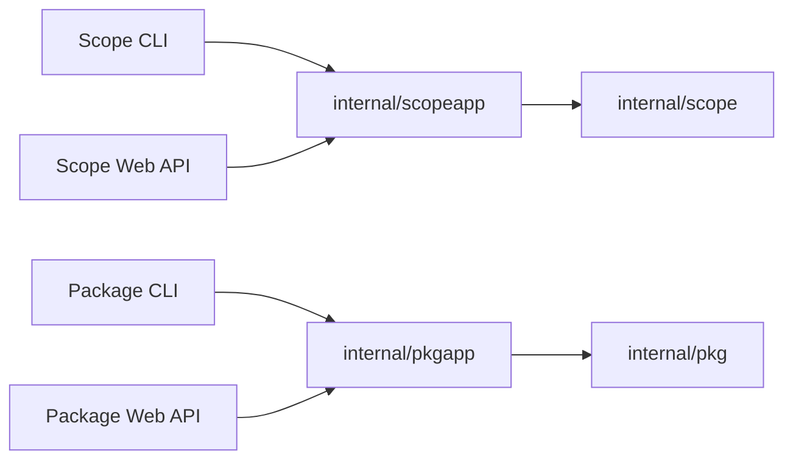

# 核心 API

## 简述

`internal/scopeapp` 与 `internal/pkgapp` 是两个领域的 transport-independent application API。CLI、Node host 和未来 Web API 都是消费层，不直接实现或复制领域语义。

## 职责

本文定义 Scope 与 Package 的进程内 Go 契约及分层边界。CLI 参数、文本输出和退出状态由 [CLI](CLI.md) 定义；Entity、Scope 与 Relation 规则由[核心协议](PROTOCOL.md)定义；Package、Registry 和 lock/store 规则由 [Package 设计](../Package设计.md)定义。

## 分层



两个领域使用相同模式：

- `*cli` 只负责参数、输出和退出状态。
- `*app` 的 exported types 和 methods 是稳定 application API。
- `scope` 与 `pkg` 实现领域规则和用例所需能力。
- `npm` 与 `packageenv` 是基础设施或跨领域 adapter。
- CLI、HTTP、JSON-RPC 或插件协议类型不得进入 `*app` 或领域包。

## Scope API

`scopeapp` 通过 execution context 使用一个已加载 Workspace，并可按同一宿主策略 load/reload：

```go
type Environment interface {
    Current() *scope.Workspace
    LoadPath(path string) (*scope.Workspace, error)
    Reload() (*scope.Workspace, error)
}
```

稳定 application surface 按领域能力组织：

| 能力 | 语义 |
| --- | --- |
| `Query(kind, selector)` | 对 Scope、Group、Entity、Relation 执行统一 list/show/find，返回稳定 envelope。 |
| `Graph(seeds, depth, via)` | 返回有向出边子图。 |
| `Path(from, to, via)` | 返回一条确定的最短有向路径。 |
| `Impact(seeds, via)` | 返回反向可达 Entity 与 Relation。 |
| `Mutate(request)` | clone/change/validate/atomic write/reload Entity 或 Relation。 |
| `Diff(left, right)` | 加载并归一化 selector 两侧语义子图后比较。 |
| `Validate()` | 返回已验证 Workspace summary。 |

宿主与 application 的边界如下：

- Workspace 来源由宿主选择。
    - standalone 使用 Pure Locus lock/store。
    - Node host 使用 npm/pnpm resolved package graph。
- stdin、cwd 和路径加载能力由共享 runner context 注入。
- Scope application 不读取进程全局 stdin 或 cwd。
- Entity result 使用 `{key, ref?, object, source?}`。
- Relation result 使用 `{fromKey,toKey,object,source?}`。
- Core 和 application DTO 不暴露 Gonum 类型、CLI writer、exit code 或 host protocol。

## Package API

`pkgapp` 对一个 project 或 package root 建立服务：

```go
func New(root string, options Options) *Service
```

| 方法 | 结果 | 语义 |
| --- | --- | --- |
| `Install(ctx, specs)` | `InstallResult` | 解析并安装声明或显式 Package。 |
| `Uninstall(ctx, names)` | `InstallResult` | 删除直接依赖并剪除不可达节点。 |
| `Update(ctx, names)` | `InstallResult` | 更新全部或指定直接依赖闭包。 |
| `List()` | `ListResult` | 返回 importer-relative dependency trees。 |
| `Pack()` | `PackResult` | 生成确定性 npm-compatible archive。 |
| `Publish(ctx)` | `PublishResult` | 打包并发布不可变 Package version。 |
| `LoadWorkspace()` | `*scope.Workspace` | 从现有 lock/store 离线装配 Workspace。 |

`pkgcli` 只消费这些方法，不依赖 `pkg`、`npm` 或 `packageenv`。

## 稳定性规则

- application result 使用稳定 DTO，不暴露 CLI writer、exit code 或 HTTP 状态。
- 新能力按领域行为增加明确 request/result；不按 CLI 命令机械创建 API。
- 查询语言使用独立 Query request/result；不使用命令字符串作为通用 API。
- 执行语义使用独立 execution service，不与只读查询合并。
- application error 的分类、reason、上下文与传播规则以[错误契约](ERRORS.md)为准；CLI 的错误输出和退出状态以 [CLI](CLI.md#输出与退出状态) 为准。程序不得解析错误文本。

## 验证

- `scopeapp` 测试排序、ownership、reference resolution 和 DTO 契约。
- `pkg` 测试 lock/store、resolution、transaction 和 Package 规则。
- `pkgapp` 的无分支转发和 DTO 转换不单独测试。
- CLI 测试只覆盖参数、输出和退出状态，不重复 application/domain semantics。
- Node 与 E2E 验证不同宿主进入相同核心 API 后得到一致结果。
