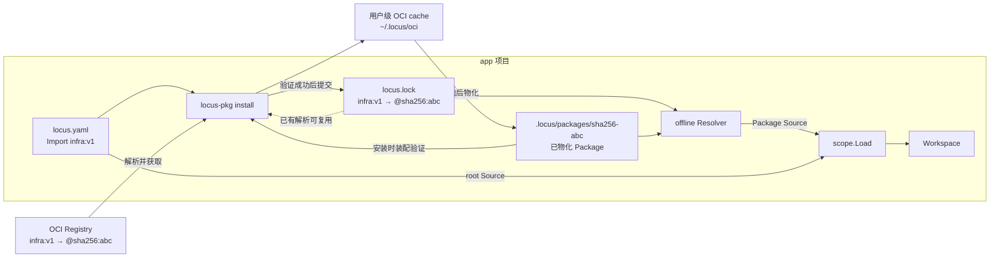

# 包管理设计

## 简述

Locus Package Infrastructure 从 OCI 获取不可变 Scope source tree，物化到项目后通过统一 Resolver 装配 Workspace。它只扩展 Source 获取。

## 职责

本文负责 Package artifact、Source identity、`locus.lock`、OCI cache、项目物化、安装流程、loader 接口和 `locus-pkg install`。不负责定义新依赖模型、SemVer、版本范围、dependency solver、Registry Server、发布命令、签名或供应链策略。

- 协议语义以 [PROTOCOL.md](protocol/PROTOCOL.md) 为唯一权威来源；本文只定义 Package Source 的获取、解析和装配边界，Scope graph 仍只来自 manifest `imports`。

## 术语表

- **[OCI（Open Container Initiative）](https://opencontainers.org/)**：制定容器镜像格式和 Registry 分发协议等开放标准的组织。本文使用 [OCI Image Format Specification](https://github.com/opencontainers/image-spec/blob/main/spec.md) 表示 Package artifact，并使用 OCI Distribution 协议从 Registry 推送和获取它。
- **OCI digest**：由摘要算法和十六进制摘要组成的内容寻址标识，例如 `sha256:<hex>`；OCI descriptor 使用它校验并定位 manifest、layer 等对象。本文所称 Package digest 和 Package identity 特指 OCI image manifest digest，不是 tag 或 layer digest。
- **Scope source tree 快照**：某个 root Scope 目录树在特定时刻的不可变副本，包括根 Scope manifest、definition documents，以及目录内通过相对路径组织的子 Scope。它是 Package 实际打包和分发的文件内容，不是协议中的 Scope 对象。
- **Artifact**：存储在 OCI Registry 中、可通过 OCI descriptor 获取和校验的分发对象。本文特指由一个 OCI image manifest 和一个 tar+gzip layer 组成的 Package；layer 保存 Scope source tree 快照，image manifest digest 是该 Package 的不可变 identity。
- **`Artifact Type`**：OCI image manifest 中声明 artifact 应用类型和处理语义的字段。本文固定为 `application/vnd.locus.scope.package.v1`，安装端据此识别 locus-scope Package 并拒绝其他类型；它不表示 layer 的编码格式，layer 格式由 `mediaType` 声明。
- **物化**：将指定 digest 的 Package 从用户级 OCI cache 解包并写入项目的 `.locus/packages/<algorithm>-<digest>/`，形成 Loader 可通过 `LocalPath` 读取的目录。物化只改变 Package 的本地存放形式和位置，不改变其 OCI digest identity。
- **Registry**：通过 OCI Distribution API 保存和分发 artifact 的服务，例如 Zot、Harbor、GHCR 或云厂商 OCI Registry。
- **Package reference**：manifest 中指向 Package 的 `oci://` 地址，可以使用可变 tag，也可以直接使用不可变 OCI digest。
- **Tag**：Registry 中指向某个 manifest 的可变名称，例如 `v1` 或 `latest`；后续发布可以让同一 tag 指向新的 digest，因此 tag 不能作为 Package identity。
- **`locus.lock`**：root Scope 目录中的解析快照，记录可变 Package reference 当前选定的不可变 digest，使后续安装和离线加载能够复用同一份内容。
- **`Source`**：Loader 对一个可加载 Scope 的定位结果，同时包含稳定 identity `Key` 和当前机器上的可读目录 `LocalPath`。
- **Resolver**：根据声明 Import 的 `Source` 和 Import reference 找到目标 `Source` 的组件；安装和离线加载使用不同实现。

## 一个例子：在项目中使用共享基础设施

假设团队已经把基础设施 Scope 发布为：

```text
oci://registry.example.com/locus/infra:v1
```

应用项目只需要在 root Scope 的 `locus.yaml` 中声明它：

```yaml
id: app
imports:
    infra: oci://registry.example.com/locus/infra:v1
```

此时项目只有声明，没有 Package 文件：

```text
app/
└── locus.yaml
```

用户在项目中执行：

```text
locus-pkg install --scope ./app
```

安装器解析 `infra:v1` 当前指向的 OCI digest，获取并检查对应 artifact，把内容缓存并物化到项目，装配完整 Workspace 验证所有 Scope，最后提交 `locus.lock`。下图强调参与者、存储位置和安装产物，而不是逐行描述命令调用：



成功后，项目中出现可重复使用的安装状态：

```text
app/
├── locus.yaml
├── locus.lock
└── .locus/
    └── packages/
        └── sha256-abc.../
            ├── locus.yaml
            └── ...
```

以后运行 `locus-scope` 时，不再访问 Registry 或用户级 cache，而是使用 `locus.lock` 和 `.locus/packages` 离线装配同一个 Workspace。若 `v1` 后来指向新的 digest，只要现有 lock 条目仍然存在，本项目就继续使用已经锁定的 `sha256:abc...`。

## 先记住的边界

- Package 管理只负责取得 Scope source tree 并交给现有 Loader，不改变 Entity、Relation、Export、Projection 等[核心协议](protocol/PROTOCOL.md)语义。
- Scope graph 仍完全来自 manifest `imports`。v1 不引入依赖清单、SemVer、版本范围或 dependency solver。
- Package identity 是 OCI image manifest digest。tag、`Manifest.ID`、Import alias 和本机物化路径都不能代替它。
- 本设计从“Registry 中已经存在合法 Package”开始，不定义发布命令、Registry Server、签名或供应链策略。
- 下载、解包、Workspace 验证或 lock 校验任一步骤失败时，原 `locus.lock` 保持不变，也不得留下新的目标物化目录。

## 选择要安装的项目

安装入口为：

```text
locus-pkg install [--scope <dir>] [--frozen] [--json]
```

- `--scope <dir>` 指定 root Scope 目录。
- 未指定 `--scope` 时，从当前目录逐级向父目录查找最近的 Scope manifest，并将其所在目录作为 root Scope。
- root Scope 目录同时是项目根；`locus.lock` 和 `.locus/packages` 都写在这里。
- `--json` 输出固定字段和稳定集合顺序，供 Agent 与脚本消费。
- 默认文本输出报告 root、解析数、复用数、获取数、物化数和最终验证结果。

## 读取 Imports

Loader 从 root Scope 开始遍历全部可达 Imports。每个 Import 属于以下一种：

| Import | 处理方式 |
| --- | --- |
| 本地路径 | 相对声明 Scope 的目录解析，或使用绝对目录 |
| Package 内相对路径 | 按当前 Package 元数据相对声明 Scope 的位置解析，且不得逃出 Package 根目录 |
| `oci://` reference | 解析为不可变 digest，取得并物化对应 Package |

一个 Package 可以包含一个 root Scope 和多个内部 Scope。artifact 根目录必须直接对应 root Scope，不能额外嵌套一层目录。Package 内部 Scope 通过不越界的相对路径互相导入；跨 Package Import 必须使用 `oci://`，不得依赖本机物化目录之间的相对位置。

循环 Import 合法。Loader 在继续读取 Imports 前按 Source identity 注册 Scope，因此再次遇到同一 Source 时能够复用已有节点。

## 把 Package reference 固定到 digest

Package reference 支持两种形式：

```text
oci://registry.example.com/locus/infra:v1
oci://registry.example.com/locus/infra@sha256:<hex>
```

省略 tag 或 digest 等价于使用 `:latest`。tag 可以变化，digest 不可变：

- 使用 tag 时，以规范化后的可变 reference 作为 lock key；
- lock 已有条目时复用其中的 digest；
- 普通模式下缺少条目时向 Registry 查询当前 digest；
- `--frozen` 下缺少条目时立即失败；
- 直接使用 digest 时已经具有不可变 identity，跳过 lock；
- tag 的解析结果必须仍属于同一 registry 和 repository。

`<root-scope>/locus.lock` 只保存可变 reference 的解析结果，不复制 Scope 依赖图：

```yaml
version: 1
packages:
    "oci://registry.example.com/locus/infra:v1":
        resolved: "oci://registry.example.com/locus/infra@sha256:abc..."
```

安装器在遍历过程中先把结果积累为待提交 snapshot。完整 Workspace 验证成功后：

- 普通模式按 key 字典序原子写入全部 reachable 条目，并删除不再 reachable 的旧条目；
- `--frozen` 要求现有 lock 的内容和 key 集合与实际依赖完全一致，允许按已锁 digest 获取本地缺失内容，但绝不增删改 lock；
- 任一检查失败时保留原文件。

## 获取并检查 Package

v1 Package 使用 OCI 1.1 image manifest，结构固定：

| 字段 | 要求 |
| --- | --- |
| `artifactType` | `application/vnd.locus.scope.package.v1` |
| `layers` | 恰好一个 `application/vnd.oci.image.layer.v1.tar+gzip` |
| Package identity | OCI image manifest digest |
| tar root | 直接对应 Package source tree |

安装器使用 ORAS 校验 descriptor digest 与 size，并拒绝：

- `artifactType` 不匹配；
- layer 数量不是一个；
- 唯一 layer 的 `mediaType` 不是 tar+gzip；
- 绝对路径、`.`、`..` 逃逸、反斜杠或重复路径；
- 链接、device、FIFO 或 sparse entry；
- 解包后 artifact 根目录中不存在唯一的 root Scope manifest。

内容流式解压到临时目录。只有归档检查和 Scope 验证全部通过，安装器才使目标物化目录可见；失败时清理临时内容。

## 缓存并放入项目

同一个 digest 的内容可能被多个项目使用，因此存储分为两层：

1. 从 Registry 获取的 OCI 内容写入或复用用户级共享 cache；
2. 通过检查的 Package 从 cache 物化到当前项目；
3. Loader 只读取项目物化目录，不直接读取全局 cache。

用户级 cache 使用标准 OCI Image Layout，不定义第二套 blob store。

路径约定：

| 位置 | 路径 |
| --- | --- |
| 用户级共享 cache | `~/.locus/oci/r-<registry>/p-<repository-segment>/...` |
| 项目物化目录 | `<root>/.locus/packages/<algorithm>-<digest>/` |

Registry 和 repository 的路径段必须先经过 OCI parser，再做可逆字节编码；不得把远程名称直接拼接成本机路径。项目物化集合保持扁平且可以由 lock 和 cache 重建，不形成嵌套 dependency tree。

如果已有 cache 条目或 digest 物化目录无效，安装器必须报错，不能自动删除或覆盖。这样可以保留现场，并避免把未知本地状态当成合法 Package。

## 把 Scope 装配成 Workspace

经过物化以后，Package 已经成为当前机器上的可读目录。Loader 不需要理解 OCI，只需要 Resolver 为每个 Import 返回一个 `Source`：

| `Source` 字段 | 含义 |
| --- | --- |
| `Key` | Scope 的稳定 identity，用于 Workspace 注册、去重和循环检测 |
| `LocalPath` | 当前机器上包含 Scope manifest 和 definition documents 的可读目录 |

不同来源使用不同的 Key，但都通过 LocalPath 读取：

| Source | `Key` |
| --- | --- |
| 本地 Scope | `file:///规范化绝对目录` |
| Package root | `oci://registry/repository@sha256:<hex>` |
| Package 内部 Scope | `oci://registry/repository@sha256:<hex>#/relative/path` |

Package 内部 Scope 的 fragment 使用 `/` 和 URL 转义。同一个 digest 即使物化在不同项目中，Key 也保持一致。

装配过程为：

1. `scope.Load` 从 root `Source` 开始；
2. Loader 从 `Source.LocalPath` 解码 Scope，并立即按 `Source.Key` 注册；
3. Loader 把每个 Import 的原始 reference 和声明它的 Source 交给 Resolver；
4. Resolver 返回目标 Source；
5. Loader 递归读取尚未注册的 Source；
6. 全部可达 Scope 加载完成后验证完整 Workspace。

安装和日常使用复用同一个 Loader，只替换 Resolver：

| Resolver | 可以使用的来源 |
| --- | --- |
| installing Resolver | 本地路径、Package 内相对路径、lock、Registry、全局 cache、项目物化目录 |
| offline Resolver | 本地路径、Package 内相对路径、lock、已有项目物化目录 |

实现接口保持为：

```go
type Source struct {
    Key       ScopeKey
    LocalPath string
}

type Resolver interface {
    Resolve(from Source, reference string) (Source, error)
}

func Load(root Source, resolve Resolver) (*Workspace, error)
```

Loader 只负责解码、递归装配和协议验证，不解析 OCI、不读取 lock、不访问 Registry，也不从物化路径推导远程 identity。

## 安装完成后的离线使用

安装期间，installing Resolver 可以访问 Registry，并按唯一 reference、digest 和物化目录统计解析数、复用数、获取数和物化数。完整 Workspace 验证成功后，安装器提交 lock。

安装完成后，`locus-scope` 使用 offline Resolver：

- 只读取 `locus.lock` 和 `.locus/packages`；
- 不访问 Registry；
- 不访问用户级 OCI cache；
- 不改变 lock 或项目物化内容；
- 缺少 lock entry 或物化目录时失败，并以 `run locus-pkg install` 结束诊断。

## Registry 边界

客户端使用 OCI Distribution 与 ORAS-go 获取 artifact，不实现 Registry Server。仅 `localhost` 和环回 IP 自动使用 HTTP，其他 Registry 使用 HTTPS。认证沿用 Docker config 和 credential helper。

Zot 是推荐的本地 Registry，但不是运行时依赖；Harbor、Distribution、GHCR 和云厂商 OCI Registry 均可替代。

## 验收

本设计按以下可观察行为验收：

- 带 OCI Import 的 root Scope 能通过一次 `locus-pkg install` 得到有效 lock、项目物化目录和完整 Workspace；
- 再次安装复用已有 lock、cache 和物化内容，不改变 Package identity；
- `--frozen` 在 lock 内容和 key 集合与完整依赖图一致时成功，否则失败且不修改 lock；
- Package 内相对 Import、跨 Package Import、循环 Import 和相同 `Manifest.ID` 的不同来源均保持正确 ownership；
- artifact 结构、digest、size、路径或 Scope 内容无效时安装失败，不提交 lock，也不留下目标物化目录；
- 安装后的 `locus-scope` 能在不访问 Registry 和全局 cache 的情况下装配相同 Workspace。

测试分层、fixture、OCI E2E、隔离和完成标准见[测试设计](base-测试设计.md)。
